# English Voice Bot

A personal Telegram bot for practicing spoken English. Send a voice message, get an immediate transcription, hear a short spoken reply, and reveal the written answer only when you are ready. The review button analyzes new learner messages and gives concise corrections in Russian.

## Features

- Telegram long polling with aiogram 3.x.
- Voice-message transcription through OpenRouter Speech-to-Text.
- Friendly conversation replies through an OpenRouter chat model.
- Text-to-Speech replies through OpenRouter, sent back as Telegram voice messages.
- Hidden assistant text using Telegram spoiler formatting.
- Reply keyboard actions: `🔍`, `⚙️`, `🧹`.
- `/settings` reminder setup with OpenRouter structured JSON output.
- Background Telegram reminders for saved practice schedules.
- Local SQLite persistence with SQLAlchemy async API.
- No permanent audio storage.

## Create a Telegram Bot

1. Open Telegram and message `@BotFather`.
2. Send `/newbot`.
3. Choose a display name and username for the bot.
4. Copy the bot token BotFather gives you.
5. Put that token into `TELEGRAM_BOT_TOKEN` in your `.env` file.

## Configure Environment

Create `.env` from the example:

```bash
cp .env.example .env
```

Fill in:

```env
TELEGRAM_BOT_TOKEN=your-telegram-token
OPENROUTER_API_KEY=your-openrouter-api-key
```

By default, any private-chat user can use the bot. To restrict it, use numeric Telegram user IDs:

```env
ALLOWED_TELEGRAM_USER_IDS=123456789,987654321
```

Telegram usernames are not supported in this setting because the bot checks Telegram's stable numeric
`from_user.id`.

The default chat model is configured as an explicit free non-Chinese OpenRouter model:

```env
OPENROUTER_CHAT_MODEL=openai/gpt-oss-120b:free
```

STT and TTS may still consume a small OpenRouter credit balance. To switch STT to the cheaper English-oriented alternative:

```env
OPENROUTER_STT_MODEL=nvidia/parakeet-tdt-0.6b-v3
```

The default TTS model is configured to an OpenRouter speech model currently returned by the Models API:

```env
OPENROUTER_TTS_MODEL=hexgrad/kokoro-82m
OPENROUTER_TTS_VOICE=af_heart
```

Reminder times are interpreted in `REMINDER_TIMEZONE` and checked by the background scheduler:

```env
REMINDER_TIMEZONE=UTC
REMINDER_CHECK_INTERVAL_SECONDS=30
```

## Reminder Settings

Use `/settings`, press `⏰ Настроить напоминания`, then describe the schedule in normal text.

Examples:

```text
каждый день утром и вечером
по вторникам и пятницам в 19:30
два раза в неделю вечером
```

The bot asks OpenRouter for a strict JSON Schema response, validates the returned JSON locally,
shows the day-by-day plan with a `✅ Да, подтвердить` inline button, and saves it in SQLite only
after confirmation.

## Install Dependencies

```bash
python3.12 -m venv .venv
source .venv/bin/activate
pip install -e ".[dev]"
```

## Run Locally

```bash
source .venv/bin/activate
python -m english_voice_bot.main
```

The bot uses long polling. Do not configure Telegram webhooks for this MVP.

## Run Tests

```bash
source .venv/bin/activate
PYTEST_DISABLE_PLUGIN_AUTOLOAD=1 pytest
```

Tests mock Telegram/OpenRouter boundaries and do not make paid API calls.

## Run With Docker

```bash
docker build -t english-voice-bot .
docker run --rm --env-file .env -v "$PWD/data:/app/data" english-voice-bot
```

The volume keeps `data/bot.sqlite3` on the host.
On startup the container fixes ownership of `/app/data`, then runs the bot as
the unprivileged `app` user.

## Run With Docker Compose

Create and fill `.env` first:

```bash
cp .env.example .env
```

Then start the bot:

```bash
docker compose up -d --build
```

View logs:

```bash
docker compose logs -f bot
```

Stop it:

```bash
docker compose down
```

Compose uses `./data:/app/data`, so the SQLite database stays on the host.
On startup the container fixes ownership of `/app/data`, then runs the bot as
the unprivileged `app` user.

## Architecture Flow

```mermaid
flowchart TD
    %% ============================================================
    %% APPLICATION BOOT
    %% ============================================================

    subgraph BOOT["1. Запуск приложения"]
        A["python -m english_voice_bot.main"] --> B["run()"]
        B --> C["asyncio.run(main())"]
        C --> D["Settings()<br/>Чтение .env и значений по умолчанию"]
        D --> E["create_engine(database_url)<br/>SQLite + aiosqlite"]
        E --> F["init_db(engine)<br/>Base.metadata.create_all()"]
        F --> G["create_session_factory(engine)"]
        G --> H["Bot(token) + Dispatcher()"]
        H --> I["include_router(commands.router)"]
        I --> J["include_router(settings.router)"]
        J --> K["include_router(callbacks.router)"]
        K --> L["include_router(dialogue.router)"]
        L --> M["OpenRouterClient(...)<br/>chat_model + stt_model + tts_model"]
        M --> SCHEDULER["run_reminder_scheduler(...)<br/>background task"]
        SCHEDULER --> WEBHOOK["bot.delete_webhook(drop_pending_updates=True)"]
        WEBHOOK --> N["dispatcher.start_polling(...)<br/>settings, session_factory,<br/>openrouter_client передаются в handlers"]
    end

    %% ============================================================
    %% UPDATE ROUTING
    %% ============================================================

    N --> UPDATE["Telegram Update"]
    UPDATE --> ROUTER{"Какой update<br/>пришёл?"}

    ROUTER -->|"/start или /help"| INTRO
    ROUTER -->|"Voice message"| VOICE_GUARD
    ROUTER -->|"Обычный text message"| TEXT_FILTER
    ROUTER -->|"/review или кнопка<br/>🔍"| REVIEW_GUARD
    ROUTER -->|"/reset"| RESET_GUARD
    ROUTER -->|"Inline callback<br/>dialogue:reset"| CALLBACK_ACK

    %% ============================================================
    %% ACCESS GUARD
    %% ============================================================

    subgraph ACCESS["2. Проверка доступа"]
        INTRO["start_command() / help_command()"] --> INTRO_GUARD{"Private chat?<br/>User ID разрешён?"}
        VOICE_GUARD{"Private chat?<br/>User ID разрешён?"}
        TEXT_GUARD{"Private chat?<br/>User ID разрешён?"}
        REVIEW_GUARD{"Private chat?<br/>User ID разрешён?"}
        RESET_GUARD{"Private chat?<br/>User ID разрешён?"}

        INTRO_GUARD -->|Нет| REJECT["Ответ:<br/>Please open a private chat...<br/>или This bot is private."]
        VOICE_GUARD -->|Нет| REJECT
        TEXT_GUARD -->|Нет| REJECT
        REVIEW_GUARD -->|Нет| REJECT
        RESET_GUARD -->|Нет| REJECT

        INTRO_GUARD -->|Да| INTRO_REPLY["Показать инструкцию<br/>и reply keyboard"]
    end

    %% ============================================================
    %% TEXT INPUT
    %% ============================================================

    subgraph TEXT_PATH["3A. Обработка текстового сообщения"]
        TEXT_FILTER{"Текст начинается с /<br/>или равен кнопке review?"}
        TEXT_FILTER -->|Да| TEXT_IGNORE["return<br/>Команду обработает другой router"]
        TEXT_FILTER -->|Нет| TEXT_GUARD
        TEXT_GUARD -->|Да| TEXT_NORMALIZE["message.text.strip()"]
        TEXT_NORMALIZE --> PREPARE_REPLY_TEXT["message.answer:<br/>💬 Preparing a reply..."]
        PREPARE_REPLY_TEXT --> COMMON_PROCESS
    end

    %% ============================================================
    %% VOICE INPUT AND STT
    %% ============================================================

    subgraph VOICE_PATH["3B. Обработка голосового сообщения"]
        VOICE_GUARD -->|Да| STATUS["message.answer:<br/>🎧 Transcribing..."]

        STATUS --> DOWNLOAD["bot.download(file_id)<br/>в io.BytesIO"]
        DOWNLOAD --> DOWNLOAD_OK{"Telegram download<br/>успешен?"}

        DOWNLOAD_OK -->|Нет| DOWNLOAD_ERROR["Отредактировать status:<br/>⚠️ I could not download..."]
        DOWNLOAD_OK -->|Да| AUDIO_MEMORY["audio_bytes: OGG<br/>только в оперативной памяти"]

        AUDIO_MEMORY --> STT["OpenRouterClient.transcribe_ogg(audio_bytes)"]
        STT --> STT_PAYLOAD["base64(audio_bytes)<br/>POST /audio/transcriptions<br/>model + input_audio.data + format=ogg"]
        STT_PAYLOAD --> STT_RETRY["Общий HTTP retry-механизм:<br/>до 3 попыток<br/>при network error, 429 и 5xx<br/>задержки 0.5s → 1.0s"]
        STT_RETRY --> STT_RESULT{"Получен корректный<br/>непустой transcript?"}

        STT_RESULT -->|"OpenRouterError"| STT_ERROR["Отредактировать status:<br/>⚠️ I could not transcribe..."]
        STT_RESULT -->|"Пустая строка"| EMPTY_ERROR["Отредактировать status:<br/>⚠️ I could not hear any speech clearly..."]
        STT_RESULT -->|Да| DELETE_STATUS["Удалить временный status"]

        DELETE_STATUS --> FORMAT_TRANSCRIPT["format_transcription(transcription)<br/>HTML blockquote"]
        FORMAT_TRANSCRIPT --> SEND_TRANSCRIPT["message.reply:<br/>📝 I understood: transcript"]
        SEND_TRANSCRIPT --> PREPARE_REPLY_VOICE["message.answer:<br/>💬 Preparing a reply..."]
        PREPARE_REPLY_VOICE --> COMMON_PROCESS
    end

    %% ============================================================
    %% COMMON USER MESSAGE PROCESSING
    %% ============================================================

    subgraph COMMON["4. Общий pipeline после получения текста"]
        COMMON_PROCESS["_process_user_message(<br/>content, source_type=text|voice<br/>)"]

        COMMON_PROCESS --> DB_SCOPE["Открыть session_scope(session_factory)"]
        DB_SCOPE --> FIND_SESSION["SELECT ChatSession<br/>WHERE telegram_chat_id = chat.id<br/>AND telegram_user_id = from_user.id"]

        FIND_SESSION --> SESSION_EXISTS{"Сессия уже есть?"}
        SESSION_EXISTS -->|Да| UPDATE_SESSION["Обновить session.updated_at"]
        SESSION_EXISTS -->|Нет| CREATE_SESSION["INSERT ChatSession"]

        UPDATE_SESSION --> ADD_USER
        CREATE_SESSION --> ADD_USER

        ADD_USER["INSERT DialogueMessage<br/>role = user<br/>source_type = voice | text<br/>content = user text<br/>telegram_message_id = incoming message ID"]
        ADD_USER --> COMMIT_USER["db.commit()<br/>Сообщение пользователя сохранено"]

        COMMIT_USER --> GET_CONTEXT["SELECT последние N сообщений<br/>ORDER BY id DESC LIMIT max_context_messages<br/>затем reverse()"]
        GET_CONTEXT --> BUILD_PROMPT["build_chat_messages(history)<br/>system prompt + user/assistant history"]

        BUILD_PROMPT --> CHAT_COMPLETION["OpenRouterClient.chat_completion(...,<br/>temperature=0.7)"]
        CHAT_COMPLETION --> CHAT_HTTP["POST /chat/completions<br/>model + messages + temperature"]
        CHAT_HTTP --> CHAT_RETRY["Общий HTTP retry-механизм:<br/>до 3 попыток при network error,<br/>429 и 5xx"]
        CHAT_RETRY --> CHAT_RESULT{"Получен assistant_text?"}

        CHAT_RESULT -->|Нет| CHAT_ERROR["Отредактировать status:<br/>⚠️ I could not generate a reply...<br/><br/>User message остаётся в БД"]
        CHAT_RESULT -->|Да| ADD_ASSISTANT["INSERT DialogueMessage<br/>role = assistant<br/>source_type = generated<br/>content = assistant_text"]

        ADD_ASSISTANT --> COMMIT_ASSISTANT["db.commit()<br/>Ответ ассистента сохранён"]
        COMMIT_ASSISTANT --> CLOSE_DB["Закрыть session_scope"]
    end

    %% ============================================================
    %% TTS AND TELEGRAM RESPONSE
    %% ============================================================

    subgraph RESPONSE["5. Генерация и отправка ответа"]
        CLOSE_DB --> SEND_RESPONSE["send_assistant_response(...)"]

        SEND_RESPONSE --> TTS["OpenRouterClient.synthesize_speech_mp3(assistant_text)"]
        TTS --> TTS_PAYLOAD["POST /audio/speech<br/>model + input + voice<br/>response_format=mp3 + speed"]
        TTS_PAYLOAD --> TTS_RETRY["Общий HTTP retry-механизм:<br/>до 3 попыток при network error,<br/>429 и 5xx"]
        TTS_RETRY --> TTS_RESULT{"Получены MP3 bytes?"}

        TTS_RESULT -->|Да| SEND_VOICE["message.answer_voice(<br/>BufferedInputFile(answer.mp3)<br/>)"]
        SEND_VOICE --> VOICE_SENT{"Telegram принял<br/>voice message?"}

        VOICE_SENT -->|Да| FORMAT_SPOILER["format_spoiler_text(assistant_text)<br/>&lt;tg-spoiler&gt;...&lt;/tg-spoiler&gt;"]
        FORMAT_SPOILER --> SEND_SPOILER["message.answer:<br/>скрытый письменный ответ<br/>+ reply keyboard"]
        SEND_SPOILER --> DELETE_REPLY_STATUS["Удалить status:<br/>💬 Preparing a reply..."]

        VOICE_SENT -->|Нет| FALLBACK_TEXT
        TTS_RESULT -->|"OpenRouterError"| FALLBACK_TEXT

        FALLBACK_TEXT["Добавить предупреждение:<br/>⚠️ Voice generation failed,<br/>so I sent only the written answer."]
        FALLBACK_TEXT --> SEND_FALLBACK["message.answer:<br/>spoiler text + warning<br/>+ reply keyboard"]
        SEND_FALLBACK --> DELETE_REPLY_STATUS
    end

    %% ============================================================
    %% REVIEW FLOW
    %% ============================================================

    subgraph REVIEW["6. Review-flow: поиск ошибок"]
        REVIEW_GUARD -->|Да| REVIEW_STATUS["message.answer:<br/>🔎 Checking your messages..."]
        REVIEW_STATUS --> REVIEW_SCOPE["Открыть session_scope"]
        REVIEW_SCOPE --> REVIEW_SESSION["get_or_create_session(chat_id, user_id)<br/>db.commit()"]

        REVIEW_SESSION --> GET_UNREVIEWED["SELECT DialogueMessage<br/>WHERE role = user<br/>AND reviewed_at IS NULL<br/>ORDER BY id ASC<br/>LIMIT max_review_messages"]

        GET_UNREVIEWED --> HAS_UNREVIEWED{"Есть новые сообщения?"}

        HAS_UNREVIEWED -->|Нет| DELETE_REVIEW_STATUS_EMPTY["Удалить status:<br/>🔎 Checking your messages..."]
        DELETE_REVIEW_STATUS_EMPTY --> NO_REVIEW["Ответ:<br/>✅ You have no new messages to review."]
        HAS_UNREVIEWED -->|Да| REVIEW_CONTEXT["Загрузить контекст вокруг целей:<br/>±3 сообщения около каждого<br/>unreviewed user message"]

        REVIEW_CONTEXT --> REVIEW_PROMPT["build_review_prompt(...)<br/>Целевые сообщения получают<br/>маркер REVIEW_TARGET"]
        REVIEW_PROMPT --> REVIEW_LLM["OpenRouterClient.chat_completion(<br/>system review prompt + dialogue,<br/>temperature=0.3<br/>)"]

        REVIEW_LLM --> REVIEW_RESULT{"LLM ответил?"}
        REVIEW_RESULT -->|Нет| REVIEW_ROLLBACK["db.rollback()<br/>Отредактировать status:<br/>⚠️ I could not generate a review..."]
        REVIEW_RESULT -->|Да| FORMAT_REPORT["format_review_report(report)<br/>Преобразование в Telegram MarkdownV2"]

        FORMAT_REPORT --> SPLIT_REPORT["split_telegram_html(...,<br/>safe limit = 3900 chars<br/>)"]
        SPLIT_REPORT --> DELETE_REVIEW_STATUS["Удалить status:<br/>🔎 Checking your messages..."]
        DELETE_REVIEW_STATUS --> SEND_CHUNKS["Отправить каждый chunk<br/>в Telegram<br/>parse_mode=MarkdownV2"]
        SEND_CHUNKS --> MARK_REVIEWED["UPDATE выбранных user messages<br/>SET reviewed_at = utc_now()"]
        MARK_REVIEWED --> REVIEW_COMMIT["db.commit()"]
    end

    %% ============================================================
    %% RESET FLOW
    %% ============================================================

    subgraph RESET["7. Сброс диалога"]
        RESET_GUARD -->|Да| RESET_SCOPE["Открыть session_scope"]
        CALLBACK_ACK["callback.answer()"] --> CALLBACK_GUARD{"User ID разрешён?"}
        CALLBACK_GUARD -->|Нет| REJECT_CALLBACK["Ответ:<br/>This bot is private."]
        CALLBACK_GUARD -->|Да| RESET_SCOPE

        RESET_SCOPE --> RESET_SESSION["get_or_create_session(chat_id, user_id)"]
        RESET_SESSION --> DELETE_HISTORY["DELETE DialogueMessage<br/>WHERE session_id = current session"]
        DELETE_HISTORY --> RESET_COMMIT["db.commit()"]
        RESET_COMMIT --> RESET_REPLY["Ответ:<br/>🧹 Dialogue history cleared.<br/>Removed N messages."]
    end
```



## Review Cursor

Learner messages are stored in `dialogue_messages` with `reviewed_at = NULL`. `/review` and the `🔍` reply button select only unreviewed user messages, send them to the review prompt, and mark those exact user-message rows as reviewed only after the report is successfully sent to Telegram.

Assistant messages are stored as context but are not marked reviewed. `/reset` and the reset inline button delete the current session dialogue history.

## Audio Storage

Incoming Telegram audio is downloaded into memory, sent to OpenRouter STT, and discarded. Generated TTS audio is also kept only in memory long enough to send it to Telegram. Audio files are not stored permanently.
# govorilka
